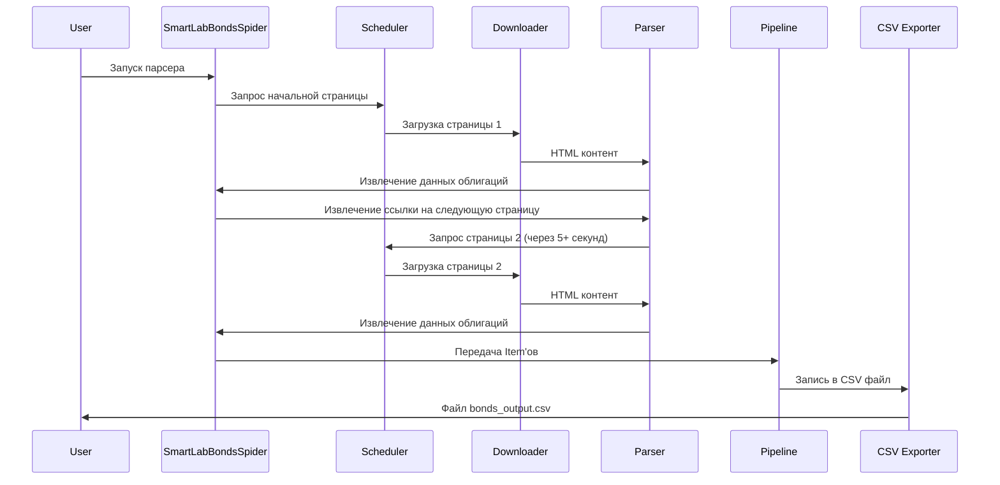

# Архитектурный план: Парсер корпоративных облигаций на Scrapy

## Обзор проекта
Парсер для сбора информации о корпоративных облигациях с сайта smart-lab.ru с использованием фреймворка Scrapy.

## Требования
1. Парсинг информации о корпоративных облигациях
2. Начальный URL: `https://smart-lab.ru/q/bonds/order_by_coupon_value/desc/page1/?paids_year=12`
3. Сбор всей доступной информации по каждой облигации на текущей странице
4. Обработка всех страниц пагинации
5. Сохранение в CSV с заголовком таблицы (исключая последние два безымянных столбца)
6. Заголовок таблицы только один раз в начале файла
7. Имитация действий реального пользователя
8. Задержка между запросами ≥5 секунд
9. Асинхронная реализация без блокировки GIL
10. ООП подход

## Архитектура

### Компоненты системы
```
bonds_parser/
├── bonds_parser/
│   ├── spiders/
│   │   └── smartlab_bonds_spider.py
│   ├── items.py
│   ├── middlewares.py
│   ├── pipelines.py
│   ├── settings.py
│   └── utils/
│       └── helpers.py
├── scrapy.cfg
├── requirements.txt
├── config/
│   └── settings.yaml
├── logs/
├── data/
│   └── bonds_output.csv
└── tests/
```

### Диаграмма последовательности


### Ключевые классы

#### 1. SmartLabBondsSpider
- Наследуется от `scrapy.Spider`
- Определяет начальные URL и настройки
- Парсит таблицу облигаций
- Обрабатывает пагинацию
- Соблюдает задержки между запросами

#### 2. BondItem
- Определяет структуру данных облигации
- Поля: номер, имя, лет до погашения, доходность и т.д.
- Соответствует столбцам таблицы на сайте

#### 3. CustomMiddleware
- Добавляет случайные User-Agent
- Реализует задержки между запросами
- Обрабатывает ошибки соединения

#### 4. CSVExportPipeline
- Сохраняет данные в CSV формат
- Гарантирует один заголовок в файле
- Обрабатывает кодировку UTF-8

## Технические детали

### Парсинг таблицы
- Анализ HTML структуры таблицы (`<table class="simple-little-table bonds">`)
- Извлечение данных из строк (`<tr>`)
- Игнорирование последних двух столбцов без названия
- Обработка возможных отсутствующих данных

### Пагинация
- Определение наличия следующей страницы
- Генерация URL для страниц: `/page2/`, `/page3/` и т.д.
- Остановка при отсутствии следующей страницы

### Задержки и имитация пользователя
- Настройка `DOWNLOAD_DELAY = 5` в settings.py
- Случайные дополнительные задержки (0-2 секунды)
- Ротация User-Agent строк
- Обработка cookies и сессий

### Обработка ошибок
- Таймауты соединения
- Ошибки HTTP (404, 500)
- Парсинг некорректного HTML
- Обработка отсутствующих данных

## План реализации

### Фаза 1: Настройка проекта
1. Создание виртуального окружения
2. Установка зависимостей (Scrapy, pandas для тестирования)
3. Инициализация проекта Scrapy
4. Базовая конфигурация

### Фаза 2: Исследование и разработка
1. Анализ структуры целевой страницы
2. Создание Spider с базовым парсингом
3. Реализация пагинации
4. Настройка задержек

### Фаза 3: Обработка данных
1. Определение Item структуры
2. Реализация Pipeline для CSV экспорта
3. Настройка Middleware для имитации пользователя
4. Добавление логирования

### Фаза 4: Тестирование и оптимизация
1. Тестирование на нескольких страницах
2. Проверка корректности данных
3. Оптимизация производительности
4. Обработка edge cases

## Риски и митигация
1. **Изменение структуры сайта**: Регулярное обновление селекторов, мониторинг
2. **Блокировка IP**: Использование задержек, ротация User-Agent
3. **Большой объем данных**: Постепенная загрузка, инкрементальное сохранение
4. **Асинхронные проблемы**: Строгое соблюдение асинхронных паттернов

## Критерии успеха
1. Парсер собирает данные со всех доступных страниц
2. CSV файл содержит корректные данные в правильном формате
3. Задержки между запросами ≥5 секунд соблюдаются
4. Парсер работает без блокировки GIL
5. Код соответствует принципам ООП и PEP8