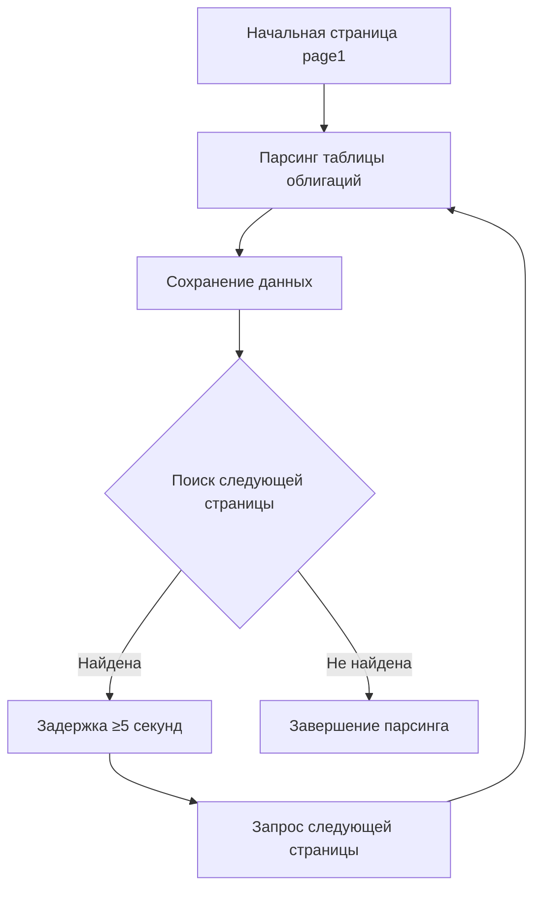

# План реализации обработки пагинации

## Обзор пагинации на smart-lab.ru

### Структура URL
- Базовая схема: `https://smart-lab.ru/q/bonds/order_by_coupon_value/desc/page{номер}/?paids_year=12`
- Номер страницы: от 1 до N (неизвестно заранее)
- Параметр `paids_year=12` фиксирован

### Стратегии обнаружения пагинации

#### 1. Анализ HTML структуры
```html
<div class="pagination">
    <span class="current">1</span>
    <a href="/q/bonds/order_by_coupon_value/desc/page2/?paids_year=12">2</a>
    <a href="/q/bonds/order_by_coupon_value/desc/page3/?paids_year=12">3</a>
    <!-- ... -->
    <a class="next" href="/q/bonds/order_by_couгации_value/desc/page2/?paids_year=12">Следующая</a>
</div>
```

#### 2. Альтернативные подходы
- Поиск ссылки "Следующая"
- Анализ всех ссылок с паттерном `/page\d+/`
- Инкрементальный перебор до получения 404

## Алгоритм обработки всех страниц

### Основной алгоритм


### Детальная реализация

#### Метод `get_next_page_url` (улучшенная версия)
```python
async def get_next_page_url(self, response) -> str:
    """
    Поиск URL следующей страницы с использованием нескольких стратегий.
    
    Стратегии в порядке приоритета:
    1. Ссылка "Следующая" (класс .next)
    2. Следующая числовая страница в пагинации
    3. Инкрементальный номер из текущего URL
    4. Проверка существования страницы
    
    Returns:
        URL следующей страницы или пустая строка
    """
    current_url = response.url
    current_page = self.extract_page_number(current_url)
    
    # Стратегия 1: Поиск ссылки "Следующая"
    next_link = response.css('.pagination a.next::attr(href)').get()
    if next_link:
        next_url = urljoin(current_url, next_link)
        self.logger.debug(f"Найдена ссылка 'Следующая': {next_url}")
        return next_url
    
    # Стратегия 2: Поиск следующей числовой страницы в пагинации
    pagination_links = response.css('.pagination a::attr(href)').getall()
    for link in pagination_links:
        link_page = self.extract_page_number(link)
        if link_page == current_page + 1:
            next_url = urljoin(current_url, link)
            self.logger.debug(f"Найдена следующая числовая страница: {next_url}")
            return next_url
    
    # Стратегия 3: Инкрементальный перебор
    # Если на странице нет явной пагинации, пробуем следующую страницу
    next_page_num = current_page + 1
    next_url = self.construct_page_url(next_page_num)
    
    # Стратегия 4: Проверка существования (опционально)
    # Можно сделать HEAD запрос, но для простоты вернем URL
    # Фактическую проверку сделает Scrapy при запросе
    
    self.logger.debug(f"Сконструирован URL следующей страницы: {next_url}")
    return next_url

def construct_page_url(self, page_number: int) -> str:
    """
    Конструкция URL для заданного номера страницы.
    
    Args:
        page_number: Номер страницы
        
    Returns:
        Полный URL
    """
    base_url = "https://smart-lab.ru/q/bonds/order_by_coupon_value/desc"
    return f"{base_url}/page{page_number}/?paids_year=12"
```

### Обработка граничных случаев

#### 1. Последняя страница
- Признаки: отсутствие ссылки "Следующая"
- Решение: возврат пустой строки из `get_next_page_url`

#### 2. Ошибка 404 (страница не существует)
- Обработка в `handle_error` методе
- Логирование и прекращение пагинации

#### 3. Изменение структуры пагинации
- Мониторинг нескольких селекторов
- Резервные стратегии

#### 4. Ограничение количества страниц
- Максимальное количество страниц для парсинга
- Защита от бесконечного цикла

### Улучшенная версия с ограничениями

```python
class SmartLabBondsSpider(scrapy.Spider):
    # ... остальной код ...
    
    def __init__(self, *args, **kwargs):
        super().__init__(*args, **kwargs)
        self.max_pages = kwargs.get('max_pages', 0)  # 0 = без ограничений
        self.max_bonds = kwargs.get('max_bonds', 0)  # 0 = без ограничений
        self.processed_pages = 0
        self.total_bonds = 0
    
    async def parse(self, response):
        # Проверка ограничения по страницам
        if self.max_pages > 0 and self.processed_pages >= self.max_pages:
            self.logger.info(f"Достигнуто ограничение по страницам: {self.max_pages}")
            return
        
        # ... парсинг данных ...
        
        # Проверка ограничения по облигациям
        if self.max_bonds > 0 and self.total_bonds >= self.max_bonds:
            self.logger.info(f"Достигнуто ограничение по облигациям: {self.max_bonds}")
            return
        
        # Поиск следующей страницы
        next_page_url = await self.get_next_page_url(response)
        if next_page_url:
            # Проверка, не превышает ли следующая страница максимальное количество
            next_page_num = self.extract_page_number(next_page_url)
            if self.max_pages > 0 and next_page_num > self.max_pages:
                self.logger.info(f"Следующая страница {next_page_num} превышает лимит {self.max_pages}")
                return
            
            yield scrapy.Request(
                url=next_page_url,
                callback=self.parse,
                errback=self.handle_error,
                meta={'page_number': next_page_num}
            )
```

### Задержки между запросами страниц

#### Настройки в settings.py
```python
# Базовая задержка 5 секунд (требование)
DOWNLOAD_DELAY = 5

# Случайная добавка от 0 до 2 секунд для имитации пользователя
RANDOMIZE_DOWNLOAD_DELAY = True
DOWNLOAD_DELAY_RANDOMIZE_ADDITION = 2

# Автоматическое регулирование скорости
AUTOTHROTTLE_ENABLED = True
AUTOTHROTTLE_START_DELAY = 5
AUTOTHROTTLE_MAX_DELAY = 10
AUTOTHROTTLE_TARGET_CONCURRENCY = 0.5
```

#### Middleware для точного контроля
```python
class PreciseDelayMiddleware:
    """Middleware для точного контроля задержек между запросами"""
    
    def __init__(self, delay):
        self.delay = delay
        self.last_request_time = 0
    
    def process_request(self, request, spider):
        import time
        current_time = time.time()
        
        # Расчет времени с последнего запроса
        time_since_last = current_time - self.last_request_time
        if time_since_last < self.delay:
            sleep_time = self.delay - time_since_last
            time.sleep(sleep_time)
            spider.logger.debug(f"Точная задержка: {sleep_time:.2f} секунд")
        
        self.last_request_time = time.time()
```

### Валидация пагинации

#### Методы проверки
1. **Проверка наличия данных**: Убедиться, что на странице есть таблица с облигациями
2. **Проверка номера страницы**: Сравнить ожидаемый и фактический номер страницы
3. **Проверка дубликатов**: Избегать повторного парсинга той же страницы

```python
async def validate_page(self, response, expected_page=None):
    """
    Валидация страницы перед парсингом.
    
    Returns:
        bool: True если страница валидна
    """
    # Проверка HTTP статуса
    if response.status != 200:
        self.logger.warning(f"Страница вернула статус {response.status}")
        return False
    
    # Проверка наличия таблицы облигаций
    table_exists = bool(response.css('table.bonds').get() or 
                       response.css('table.simple-little-table.bonds').get())
    
    if not table_exists:
        self.logger.warning("На странице не найдена таблица облигаций")
        return False
    
    # Проверка номера страницы (если ожидается)
    if expected_page:
        actual_page = self.extract_page_number(response.url)
        if actual_page != expected_page:
            self.logger.warning(f"Несоответствие номеров страниц: ожидалось {expected_page}, получено {actual_page}")
    
    return True
```

### Обработка ошибок пагинации

#### Метод `handle_error` для пагинации
```python
async def handle_pagination_error(self, failure):
    """
    Специализированная обработка ошибок пагинации.
    """
    request = failure.request
    page_num = request.meta.get('page_number', 'unknown')
    
    if failure.check(scrapy.exceptions.HttpError):
        # HTTP ошибки (404, 500 и т.д.)
        response = failure.value.response
        if response.status == 404:
            self.logger.info(f"Страница {page_num} не найдена (404). Пагинация завершена.")
            return  # Завершаем пагинацию
        else:
            self.logger.error(f"HTTP ошибка {response.status} на странице {page_num}")
    
    elif failure.check(scrapy.exceptions.TimeoutError):
        self.logger.warning(f"Таймаут при запросе страницы {page_num}")
        # Можно попробовать повторить, но по требованиям не нужно
    
    else:
        self.logger.error(f"Неизвестная ошибка на странице {page_num}: {failure.getErrorMessage()}")
```

### Тестирование пагинации

#### Тестовые сценарии
1. **Нормальный поток**: page1 → page2 → page3 → ... → последняя страница
2. **Ограничение страниц**: Парсинг только первых N страниц
3. **Ошибка 404**: Автоматическое завершение при достижении несуществующей страницы
4. **Пустая страница**: Обработка страницы без таблицы облигаций
5. **Изменение URL структуры**: Проверка устойчивости к изменениям

#### Скрипт тестирования
```python
import scrapy
from scrapy.crawler import CrawlerProcess
from bonds_parser.spiders.smartlab_bonds_spider import SmartLabBondsSpider

def test_pagination():
    """Тестирование пагинации на ограниченном количестве страниц"""
    process = CrawlerProcess(settings={
        'DOWNLOAD_DELAY': 1,  # Уменьшенная задержка для тестов
        'LOG_LEVEL': 'DEBUG',
        'FEED_FORMAT': 'csv',
        'FEED_URI': 'test_pagination.csv',
    })
    
    process.crawl(SmartLabBondsSpider, max_pages=3)
    process.start()
```

### Оптимизация производительности

#### Кэширование запросов
```python
# В settings.py
HTTPCACHE_ENABLED = True
HTTPCACHE_EXPIRATION_SECS = 3600  # 1 час
HTTPCACHE_DIR = 'httpcache'
HTTPCACHE_IGNORE_HTTP_CODES = [500, 502, 503, 504, 400, 404]
```

#### Параллельная обработка (с ограничениями)
```python
# Не рекомендуется из-за требования задержек ≥5 секунд
# Но можно использовать для тестирования
CONCURRENT_REQUESTS = 1  # Только один одновременный запрос
```

### Мониторинг прогресса

#### Логирование прогресса
```python
class ProgressLogger:
    """Логирование прогресса парсинга"""
    
    def __init__(self, spider):
        self.spider = spider
        self.start_time = time.time()
    
    def log_progress(self):
        """Логирование текущего прогресса"""
        elapsed = time.time() - self.start_time
        pages_per_hour = self.spider.processed_pages / (elapsed / 3600) if elapsed > 0 else 0
        
        self.spider.logger.info(
            f"Прогресс: страниц {self.spider.processed_pages}, "
            f"облигаций {self.spider.total_bonds}, "
            f"скорость {pages_per_hour:.1f} стр/час"
        )
```

## Итоговый план реализации

### Этап 1: Базовая пагинация
1. Реализовать метод `get_next_page_url` с основной логикой
2. Интегрировать в метод `parse`
3. Протестировать на 2-3 страницах

### Этап 2: Обработка ошибок
1. Реализовать `handle_error` для пагинации
2. Добавить валидацию страниц
3. Обработать граничные случаи

### Этап 3: Оптимизация
1. Добавить ограничения (max_pages, max_bonds)
2. Реализовать точные задержки
3. Добавить мониторинг прогресса

### Этап 4: Тестирование
1. Тестирование нормального потока
2. Тестирование ошибок
3. Тестирование производительности

## Ожидаемые результаты
- Парсер обрабатывает все доступные страницы
- Соблюдаются задержки между запросами
- Обрабатываются ошибки пагинации
- Прогресс логируется для мониторинга